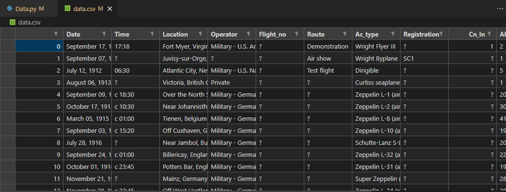
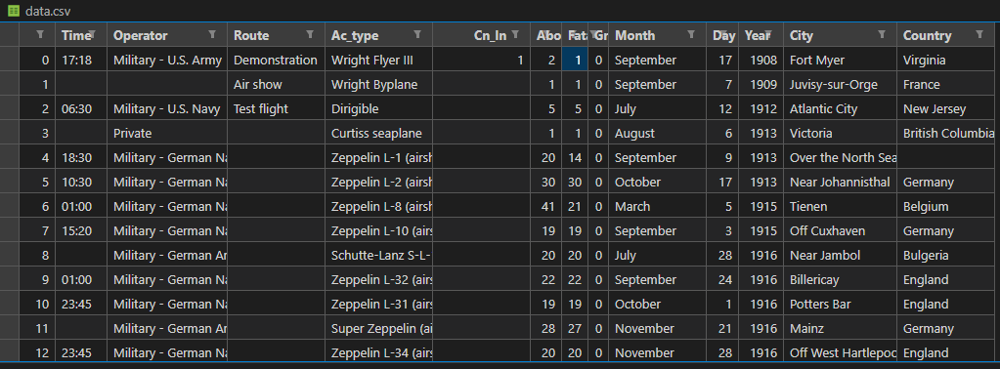
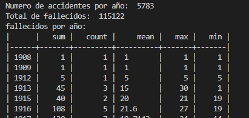
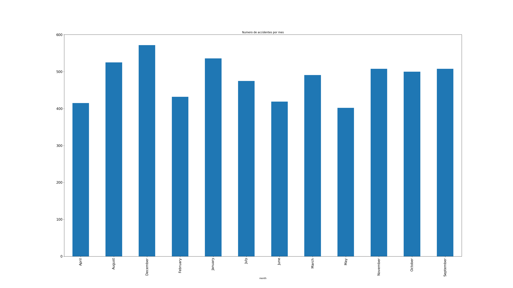

# CrashPlaned
 Proyecto de Mineria de Datos basado en los accidentes de aviones historicamente

<!-- Improved compatibility of back to top link: See: https://github.com/othneildrew/Best-README-Template/pull/73 -->
<a name="readme-top"></a>
<!--
*** Thanks for checking out the Best-README-Template. If you have a suggestion
*** that would make this better, please fork the repo and create a pull request
*** or simply open an issue with the tag "enhancement".
*** Don't forget to give the project a star!
*** Thanks again! Now go create something AMAZING! :D
-->


<!-- PROJECT SHIELDS -->
<!--
*** I'm using markdown "reference style" links for readability.
*** Reference links are enclosed in brackets [ ] instead of parentheses ( ).
*** See the bottom of this document for the declaration of the reference variables
*** for contributors-url, forks-url, etc. This is an optional, concise syntax you may use.
*** https://www.markdownguide.org/basic-syntax/#reference-style-links
-->


<!-- PROJECT LOGO -->
<br />
<div align="center">
  <a href="https://github.com/Crissomar1/ClashedPlaned">
    
  </a>

  <h3 align="center">Mineria de datos</h3>

  <p align="center">
    Proyecto hecho para la materia de Mineria de Datos de la FCFM de la UANL
    <br />
    <a href="https://github.com/Crissomar1/ClashedPlaned"><strong>Explore los archivos »</strong></a>
    <br />
    <br />
    <a href="https://github.com/Crissomar1/ClashedPlaned">Mire la demostracion</a>
    ·
    <a href="https://github.com/Crissomar1/ClashedPlaned/issues">Reporte un error</a>
    ·
    <a href="https://github.com/Crissomar1/ClashedPlaned/issues">Solicite una funcion</a>
  </p>
</div>


<!-- TABLE OF CONTENTS -->
<details>
  <summary>Tabla de contenidos</summary>
  <ol>
    <li>
      <a href="#Acerca-del-proyecto">Acerca del proyecto</a>
      <ul>
        <li><a href="#Columnas">Resultados</a></li>
        <li><a href="#Hecho-con">Hecho con</a></li>
      </ul>
    </li>
    <li>
      <a href="#Iniciacion">Iniciacion</a>
      <ul>
        <li><a href="#Prerrequisitos">Prerrequisitos</a></li>
        <li><a href="#Instalacion">Instalacion</a></li>
      </ul>
    </li>
    <li><a href="#Uso">Uso</a></li>
    <li><a href="#roadmap">Roadmap</a></li>
    <li><a href="#Contacto">Contacto</a></li>
    <li><a href="#Agradecimientos">Agradecimientos</a></li>
  </ol>
</details>


<!-- ABOUT THE PROJECT -->
## Acerca del proyecto



_Datos_

Los datos de los accidentes aereos encontrados en https://www.kaggle.com/datasets/nguyenhoc/plane-crash/data fueron recuperados de https://www.planecrashinfo.com/ usando el scrapper https://github.com/hocnx/planecrashinfo_scraping conteniendo datos de accidentes desde 1908 hasta 2018, cuenta con 5783 registros y descripciones de los accidentes.

### Columnas
* Fecha.
* Hora.
* Lugar.
* Operador.
* Ruta.
* Tipo de aeronave.
* Numero de personas abordo (tripulación y pasajeros).
* Numero de fatalidades abordo (tripulación y pasajeros).
* Numero de fatalidades en tierra.


### Hecho con


* [![Python3][Py3]][Py3-url]
* [![VSCode][VSC]][VSCode-url]

<p align="right">(<a href="#readme-top">back to top</a>)</p>


<!-- GETTING STARTED -->
## Iniciacion

Para hacer uso de este magnifico proyecto debes contar con lo siguiente:

### Prerrequisitos

* Beautiful Soup 
* Pandas
* Tabulate
  ```sh
  pip install pandas beautifulsoup4 tabulate
  ```

### Instalacion

_Instalacion del codigo._

1. Descarga el repositorio o clonalo.
2. Descomprime si es necesario.
2. Encuentrate en la ubicacion del codigo fuente.
3. Inicia una instancia de PowerShell en la misma ubicacion
3. Corre el programa
   ```sh
    python Data.py
   ```

<p align="right">(<a href="#readme-top">back to top</a>)</p>


<!-- USAGE EXAMPLES -->
## Uso

Siemplemente corre el programa y espera a que termine, el programa se encargara de todo lo demas.
Generara un archivo llamado "CrashPlaned.csv" con los datos de los accidentes aereos ademas de archivos con la informacion procesada.





* mira https://github.com/Crissomar1/ClashedPlaned/blob/Tarea-3/Tarea-3/Stats.txt



'''
ANOVA TEST
H0: mu_2000 = mu_2001
H1: mu_2000 != mu_2001
alpha = 0.05
p-value:
                sum_sq     df          F        PR(>F)
year      22313.563272    1.0  37.750059  1.432003e-08
Residual  62655.205246  106.0        NaN           NaN
Reject H0
'''


<!--_For more examples, please refer to the [Documentation](https://example.com)_-->

<p align="right">(<a href="#readme-top">back to top</a>)</p>


<!-- ROADMAP -->
## Roadmap

- [x] Data obtention
- [x] Data Cleaning
- [x] Descriptive Statistics
- [x] Data Visualization
- [x] Statistic Test
- [ ] Linear Models
- [ ] Forecasting
- [ ] Data classification
- [ ] Data clustering
- [ ] Text analysis
- [ ] RNN

## Explora

* [Tarea 1: Base de Datos](https://github.com/Crissomar1/ClashedPlaned/tree/Tarea-1)
* [Tarea 2: Limpieza](https://github.com/Crissomar1/ClashedPlaned/tree/Tarea-2)
* [Tarea 3: Estadisticas](https://github.com/Crissomar1/ClashedPlaned/tree/Tarea-3)
* [Tarea 4: Visuales](https://github.com/Crissomar1/ClashedPlaned/tree/Tarea-4)
* [Tarea 4: Prueba](https://github.com/Crissomar1/ClashedPlaned/tree/Tarea-5)

<p align="right">(<a href="#readme-top">back to top</a>)</p>


<!-- CONTACT -->
## Contacto

Cristian Morales - crissomar@hotmail.com

Project Link: [https://github.com/Crissomar1/ClashedPlaned](https://github.com/Crissomar1/ClashedPlaned)

<p align="right">(<a href="#readme-top">back to top</a>)</p>


<!-- ACKNOWLEDGMENTS -->
## Agradecimientos

De este repositorio me inspire :)

* [GitHub Profesor](https://github.com/ppGodel/data_mining)

<p align="right">(<a href="#readme-top">Regresa al inicio</a>)</p>


<!-- MARKDOWN LINKS & IMAGES -->
<!-- https://www.markdownguide.org/basic-syntax/#reference-style-links -->

[Py3]: https://img.shields.io/badge/Python_3-306998?style=for-the-badge&logo=python&logoColor=white
[Py3-url]: https://www.python.org/downloads/
[VSC]: https://img.shields.io/badge/Visual%20Studio%20Code-0078d7.svg?style=for-the-badge&logo=visual-studio-code&logoColor=white
[VSCode-url]: https://code.visualstudio.com/